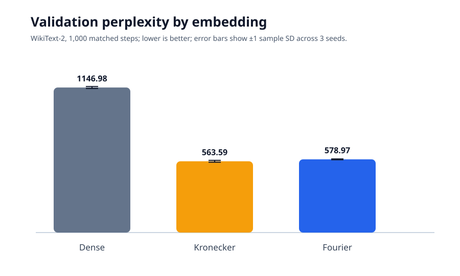
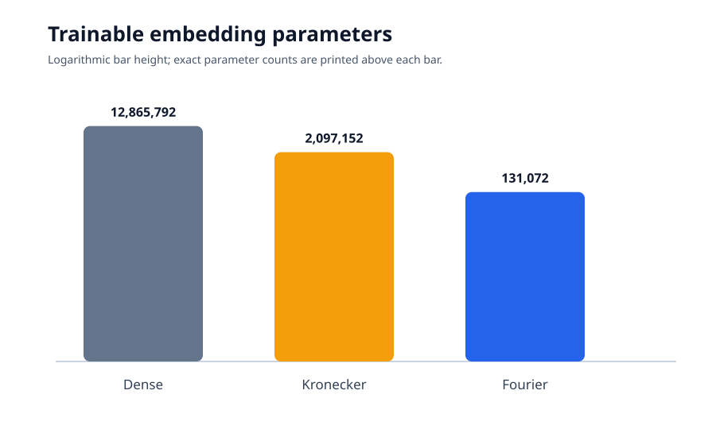
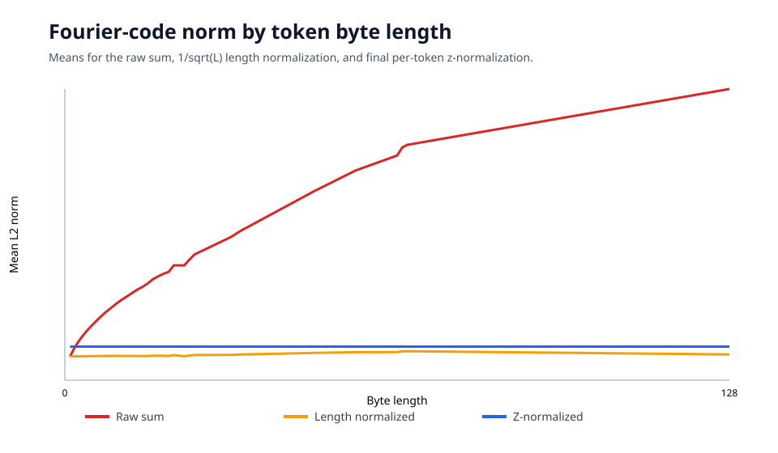
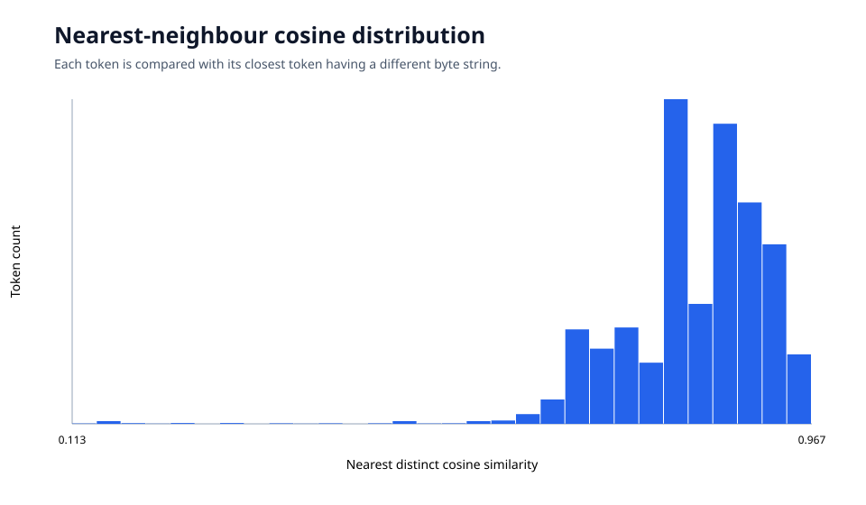

# Benchmark results — PASS

The overall verdict is computed from explicit criteria. It is not a claim of
universal injectivity or superiority on tasks outside this experiment.

## Acceptance criteria

| Criterion | Measured | Required | Status |
|---|---:|---:|:---:|
| Fourier mean validation PPL regression vs Kronecker | 2.73% | ≤ 3.00% | **PASS** |
| Kronecker/Fourier embedding parameter ratio | 16.00× | ≥ 16.00× | **PASS** |
| Exact distinct-byte collision groups, GPT-2 vocabulary | 0 | = 0 | **PASS** |
| Quantized collision groups at 4 decimals, GPT-2 vocabulary | 0 | = 0 | **PASS** |
| Near-collision pairs at cosine ≥ 0.99, tested 10K subset | 0 | = 0 | **PASS** |

## Matched training

WikiText-2 raw training used 500,000 GPT-2 tokens, 1,000 optimizer steps,
effective batch size 32, and deterministic seeds 1337, 2027, and 3407. Every
arm used the same transformer, data order, optimizer settings, output head, and
parameter-free token normalization.

| Embedding | Validation PPL | Embedding params | Total params | Tokens/s |
|---|---:|---:|---:|---:|
| Dense | 1146.98 ± 7.74 | 12,865,792 | 28,923,904 | 1163.1 ± 24.4 |
| Kronecker | 563.59 ± 7.36 | 2,097,152 | 18,155,264 | 1184.1 ± 238.5 |
| Fourier-512 | 578.97 ± 3.32 | 131,072 | 16,189,184 | 1162.1 ± 58.6 |

Fourier's paired validation-PPL regression relative to Kronecker was 1.76%,
2.88%, and 3.57% for the three seeds; the ratio of aggregate means was 2.73%.
Throughput is reported but not used as a pass criterion because hosted-runner
variance was large, particularly for Kronecker.

### Derived Fourier–Kronecker statistics

These are descriptive statistics generated from the same committed runs. They
do not add or change the two acceptance criteria.

| Quantity | Value |
|---|---:|
| Absolute aggregate-mean validation PPL difference | 15.38 |
| Aggregate-mean validation PPL regression | 2.73% |
| Mean paired validation PPL regression | 2.74% |
| Paired-regression sample standard deviation | 0.91% |
| Paired-regression 95% Student-t interval | [0.46%, 5.01%] |
| Worst-seed validation PPL regression | 3.57% |
| Projection-parameter reduction | 16.00× (93.75% fewer) |
| Raw float32 projection-weight storage | 8.00 MiB → 0.50 MiB |

The paired interval is wide because it contains only three seed pairs. Raw
float32 weight storage excludes gradients, optimizer state, activations, and
the rest of the model; it is not an end-to-end memory or speed claim.





## Collision analysis

Exact and 3/4/5-decimal quantized collision checks covered all 50,257 GPT-2
token IDs and excluded tokenizer entries with identical byte strings. Exact
all-pairs cosine analysis covered a deterministic 10,000-token subset.

| D | Exact groups | Quantized groups (4 dp) | Cosine ≥ 0.99 | Worst cosine | Minimum margin |
|---:|---:|---:|---:|---:|---:|
| 128 | 0 | 0 | 0 | 0.97627 | 0.02373 |
| 256 | 0 | 0 | 0 | 0.96910 | 0.03090 |
| 512 | 0 | 0 | 0 | 0.96656 | 0.03344 |

## Representation diagnostics

The full D=512 diagnostic analyzed norms and collision groups for all 50,257
GPT-2 token IDs. Its exact all-pairs neighbor search used the same documented
10,000-token deterministic prefix as the collision report.

| Measurement | Result |
|---|---:|
| Exact collision groups, full vocabulary | 0 |
| Four-decimal collision groups, full vocabulary | 0 |
| Maximum distinct-token cosine, 10K subset | 0.966559 |
| Minimum cosine self-retrieval margin | 0.033441 |
| Minimum distinct Euclidean distance | 5.846053 |
| Median nearest-distinct cosine | 0.846005 |
| 99th-percentile nearest-distinct cosine | 0.954370 |

Raw-sum norm was strongly associated with byte length (Pearson r=0.9758).
Dividing by `sqrt(L)` reduced the measured correlation to 0.3310. Final
per-token z-normalization made the norm nearly constant at 22.6053, with a
sample standard deviation of approximately 1.14e-6. The norm-length
correlation is therefore marked unavailable at that stage instead of reporting
a floating-point-noise correlation.





The closest pairs were predominantly orthographic variants such as
`relationship`/`relationships`, `communication`/`communications`, and
`organization`/`organizations`. This is evidence of byte-level neighborhood
continuity, not a semantic-similarity result. Because z-normalization makes
vector norms nearly equal, Euclidean distance is approximately
`sqrt(2 * norm^2 * (1 - cosine))`; the Euclidean and cosine measurements are
therefore not independent evidence.

## Interpretation limits

- The PASS verdict applies only to the listed thresholds and experiment.
- Zero measured collisions does not prove injectivity over arbitrary strings.
- The near-collision search covered 10,000 tokens, not every vocabulary pair.
- Dense validation performance in this bounded run must not be generalized to
  fully trained production language models.
- Runtime results from shared hosted runners are noisy and are not a speed
  guarantee.

Machine-readable values are in [`training_results.json`](training_results.json),
[`collision_results.json`](collision_results.json), and
[`representation_analysis.json`](representation_analysis.json).
Regenerate the training plots with:

```bash
python experiments/plot_benchmarks.py
```

Regenerate the representation JSON and its plots with:

```bash
python experiments/analyze_representation.py \
  --dimension 512 --max-tokens 50257 --near-max-tokens 10000
```
